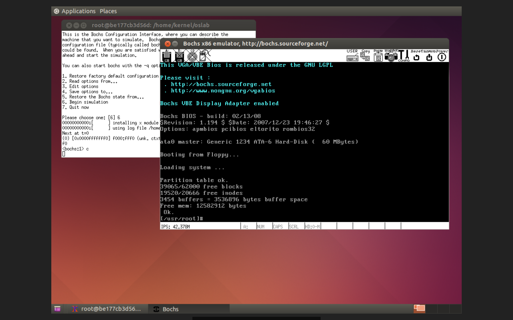

reused queeno's Dockerfile

#how to make linux-0.11 Image:

		root# cd $HOMEDIR/gcc-3.4/ && ./inst.sh amd64
		root# apt-get install bin87 libc6-dev-i386
		root# cd $HOMEDIR/oslab/linux-0.11/ && make
		#And there's your Image!

#how to boot linux-0.11 in bochs:

		root# vncserver :1
			... #some configs.
		root# export OSLAB_PATH=/home/kernel/oslab
		root# DISPLAY=:1 bochs -f bochs/bochsrc.bxrc
		
		#Log in from a vnc client, and there's your x11 window!

